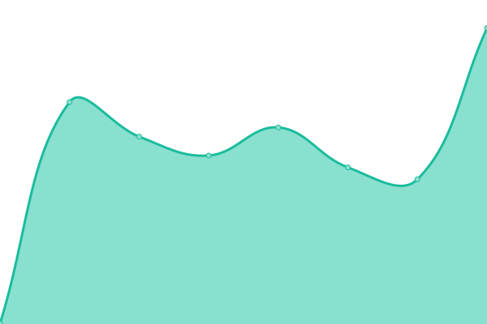

# [📈 Monse Live Status](https://get-monse.github.io/uptime/): <!--live status--> **🟩 All systems operational**

<!--start: status pages-->
<!-- This summary is generated by Upptime (https://github.com/upptime/upptime) -->
<!-- Do not edit this manually, your changes will be overwritten -->
<!-- prettier-ignore -->
| URL | Status | History | Response Time | Uptime |
| --- | ------ | ------- | ------------- | ------ |
|  [Landing page](https://get.monse.app) | 🟩 Up | [landing-page.yml](https://github.com/get-monse/uptime/commits/HEAD/history/landing-page.yml) | 

 393ms
     
 | 

<a href="https://get-monse.github.io/uptime/history/landing-page">100.00%</a>
    

|  [App](https://monse.app) | 🟩 Up | [app.yml](https://github.com/get-monse/uptime/commits/HEAD/history/app.yml) | 

 373ms
     
 | 

<a href="https://get-monse.github.io/uptime/history/app">100.00%</a>
    

<!--end: status pages-->

## 📄 License

- Powered by: [Upptime](https://github.com/upptime/upptime)
- Code: [MIT](./LICENSE) © [Upptime](https://upptime.js.org)
- Data in the `./history` directory: [Open Database License](https://opendatacommons.org/licenses/odbl/1-0/)
